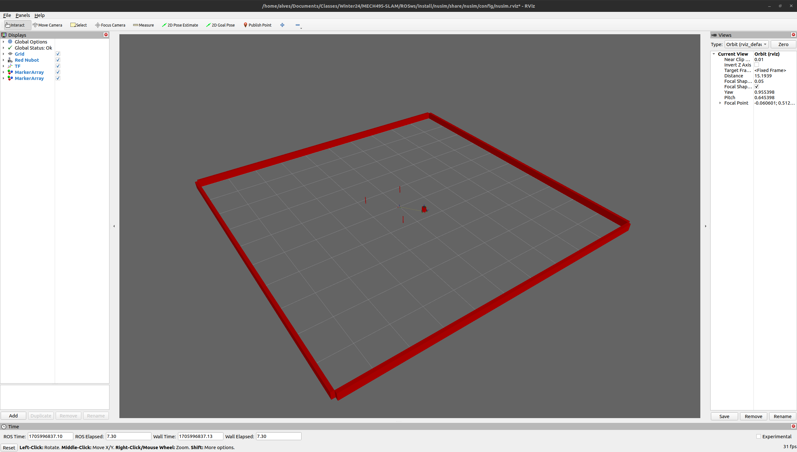

# Nuturtle  Description
* `ros2 launch nusim nusim` to see the red robot in rviz with arena walls and obsticles.

# Launch File Details
* `ros2 launch nusim nusim --show-args`

```
Arguments (pass arguments as '<name>:=<value>'):

    'config_file':
        Location of file containing launch parameters
        (default: 'config/basic_world.yaml')

    'use_jsp':
        gui (default): use jsp_gui, jsp: use joint_state_publisher, none: no joint states published
        (default: 'gui')

    'use_rviz':
        true (default): start rviz, otherwise don't start rviz
        (default: 'true')

    'color':
        purple (default): the color of the turtlebot (purple, red, green, or blue). Valid choices are: ['purple', 'red', 'green', 'blue']
        (default: 'purple')
```