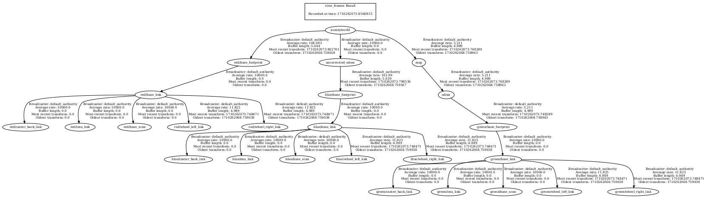

# Nuslam  Description
Launches all nodes from nuturtle_control package along with a slam node that controls a green robot to follow the red robot based on odometry and deteccted landmarks.

Visualization of the frames used in this simulation:

# Launch File Details
* `ros2 launch nuslam slam.launch.py`

```
Arguments (pass arguments as '<name>:=<value>'):

    'config_file':
        The name of the configuration yaml file
        (default: 'diff_params.yaml')

    'with_slam':
        Selects the source of the cmd_vel publisher. Valid choices are: ['true', 'false']
        (default: 'true')

    'cmd_src':
        Selects the source of the cmd_vel publisher. Valid choices are: ['circle', 'teleop', 'none']
        (default: 'circle')

    'robot':
        Selects whether the robot will be simulated or real. Valid choices are: ['nusim', 'localhost', 'none']
        (default: 'nusim')

    'use_rviz':
        Whether rviz2 should be launched or not. Valid choices are: ['true', 'false']
        (default: 'true')

    'draw_only':
        Selects whether to just draw the configured objects or not. Valid choices are: ['true', 'false']
        (default: 'false')

    'use_slam':
        Used by the slam launch file. Valid choices are: ['true', 'false']
        (default: 'false')
```