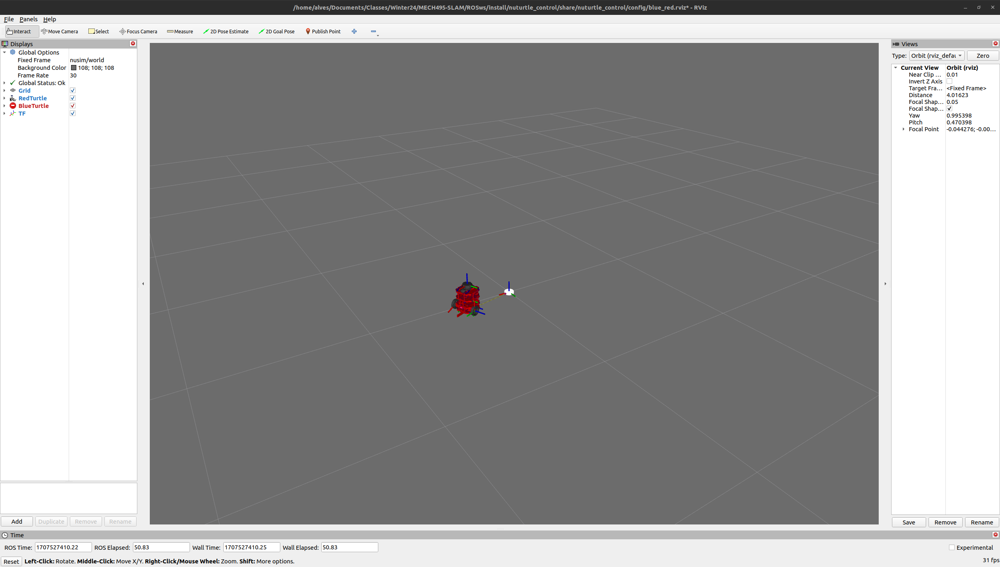

# nuturtle_control  Description
* `ros2 launch nuturtle_control start_robot.launch.py` to see the red robot in rviz with the blue robot representing estimated location through odometry.

# Launch File Details
* `ros2 launch nuturtle_control start_robot.launch.py --show-args`

```
Arguments (pass arguments as '<name>:=<value>'):

    'cmd_src':
        Selects the source of the cmd_vel publisher. Valid choices are: ['circle', 'teleop', 'none']
        (default: 'circle')

    'robot':
        Selects whether the robot will be simulated or real. Valid choices are: ['nusim', 'localhost', 'none']
        (default: 'nusim')

    'use_rviz':
        Whether rviz2 should be launched or not. Valid choices are: ['true', 'false']
        (default: 'true')

    'config_file':
        The name of the configuration yaml file
        (default: 'diff_params.yaml')
```